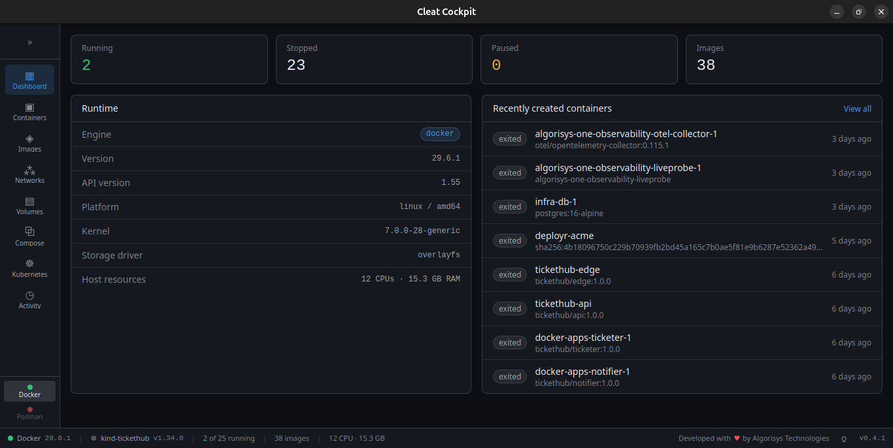

# Cleat

A fast, native desktop app for managing containers — **Docker and Podman**, side by side, from one window.

Built with Rust + Tauri v2 and React/TypeScript. No Electron, no background HTTP server, no daemon of its own.



> A cleat is the fitting on a dock you tie a mooring line to — the small piece of hardware that holds things in place.

```
./dev-start.sh          # run it
./dev-start.sh --test   # test it
```

---

## What it does

**Containers** — list running and stopped, start / stop / restart / pause / resume / remove, inspect full JSON, health status, and control services inside a container via its init system.

**Bulk actions** — select rows across containers, images, networks and volumes (shift-click for a range) and act on the whole selection. Container actions apply to the eligible subset, so starting a mixed selection starts the stopped half rather than erroring on the rest. Failures are collected and reported per resource instead of aborting the run.

**Run a container** — create one from any image with ports, environment, volumes, network, restart policy and auto-remove. The command field is exact argv, not a shell string, and shows you how it tokenised before you commit.

**Interactive terminal** — a real TTY attached to a shell inside a running container, with resize tracking so full-screen programs render correctly. The shell is probed per container, so it works on images without bash.

**Live logs** — real follow mode with search and stdout/stderr filtering, not a one-shot `tail`.

**Live stats** — CPU, memory, network and block I/O streamed once per second with inline sparklines. Memory is page-cache-corrected so it matches what `docker stats` reports.

**Images** — list, pull with real per-layer progress, inspect, layer history, prune, remove.

**Private registries** — pull *and* push with the login you already have. Cleat reads `docker login` / `podman login` state, including credentials held in the OS keychain by a credential helper, and never stores a copy of its own. Both dialogs name the registry and the identity they will use before you start, so a 401 is diagnosable without reading daemon logs, and a **Registries** panel lists every login Cleat can see and where it read it from.

**Push** — tag and push in one step. A registry only accepts references its own name prefixes, so the dialog defaults to the image's current name, shows where that would actually land, and tags it for you before pushing. Tagging copies nothing.

**Copy images between runtimes** — Docker and Podman keep completely separate image stores. Cleat streams an image from one into the other over the Engine API: no temp file, no CLI, nothing buffered to disk.

**Networks** — list with subnets and *attached containers*, create (bridge / macvlan / ipvlan / overlay, internal), inspect, remove.

**Volumes** — list with sizes, create, inspect, prune, remove. Filters to just the anonymous ones containers created for themselves, which is the pile that actually accumulates.

**Kubernetes** — reads the same kubeconfig `kubectl` does, including its auth plugins, so a cluster you can already reach works without being set up twice. Context switcher with reachability and server version, namespace filter, and tables for pods, deployments, services and nodes. Pod status is what `kubectl` shows rather than `status.phase`, so `CrashLoopBackOff` surfaces instead of a useless "Running". Streamed pod logs, inspect as JSON, delete.

**Pod terminal and port-forward** — a real TTY inside a pod, same as the container one, with resize tracking; the shell is probed (bash, sh, busybox) because a distroless image has none. Port forwards bind loopback only: a forward is a hole into a cluster network, so it is not offered to the rest of your LAN.

**Edit live resources** — fetch any object as YAML with the server-managed noise stripped, edit it, and apply it back through the same dry-run gate.

**Every workload kind** — Deployments get their own tab with scale and rollout restart; StatefulSets, DaemonSets, Jobs and CronJobs share one, since they differ mostly in which number means what. Plus events, ConfigMaps and Secrets (key names only — values are never fetched).

**Apply YAML** — paste a manifest and see exactly what it would do before it does it. The dry run is server-side: real validation, real admission webhooks, real defaulting, nothing persisted. Apply stays disabled until a dry run comes back clean. Works for CRDs the binary has never heard of, because kinds are resolved against the cluster's own API at runtime.

**Deploy a container to a cluster** — generates a Deployment and Service from a running container, or from every service in a compose project. Emits a Deployment rather than the bare Pod `podman generate kube` produces: nothing restarts a Pod, nothing rolls it, and it cannot scale. The translation is lossy and says so — bind mounts to paths on this machine, host port bindings, privileged containers and environment values that look like secrets each raise a warning shown above the YAML, before anything is applied.

**Light and dark themes** — a bulb in the sidebar footer. Every text colour in both palettes is held to WCAG AA against both background surfaces, verified by converting OKLCH to sRGB and computing the ratio rather than by eye.

**Compose** — pick a project directory, bring stacks up and down, restart individual services, with live streaming output and a working Cancel button.

**Activity log** — every call Cleat makes to a runtime, with arguments, timing and outcome. These are the real Engine API requests, not reconstructed `docker` commands; compose rows show the literal argv because compose is the one subprocess. Values that look like secrets are masked.

**Runtime switcher** — Docker and Podman detected independently, each reporting *why* it isn't available when it isn't. Runtimes that aren't installed are hidden; installed-but-not-running ones stay visible with the command that fixes them.

## Requirements

- Rust (stable) — [rustup.rs](https://rustup.rs)
- Node 20+
- Docker and/or Podman
- Linux: `libwebkit2gtk-4.1-dev build-essential curl wget file libxdo-dev libssl-dev libayatana-appindicator3-dev librsvg2-dev`

Podman needs its API socket running:

```sh
systemctl --user start podman.socket     # rootless
```

**Podman is Linux and macOS only.** On Windows it serves a named pipe from a
`podman machine` VM rather than a socket, which Cleat does not speak yet — the
runtime switcher says so rather than pretending. Windows talks to Docker Desktop
over its named pipe; use WSL if you need Podman.

## Running

```sh
./dev-start.sh            # dev mode with hot reload
./dev-start.sh --test     # Rust test suite
./dev-start.sh --clean    # wipe node_modules + target, then run
```

Or directly, from `tauri-rs/`:

```sh
npm install
npm run tauri dev
```

> **Running from a snap-confined terminal** (the VS Code snap, and others) fails
> with:
>
> ```
> symbol lookup error: /snap/core20/current/lib/x86_64-linux-gnu/libpthread.so.0:
> undefined symbol: __libc_pthread_init, version GLIBC_PRIVATE
> ```
>
> `GTK_PATH` is the culprit: it points into the snap, GTK loads its modules from
> there, and those pull in the snap's older glibc. Note that `$SNAP` and
> `LD_LIBRARY_PATH` may both be *unset* while this still happens, so neither is a
> reliable thing to test for.
>
> `dev-start.sh` detects and strips these automatically. If you invoke
> `npm run tauri dev` (or the built binary) yourself, clear them first:
>
> ```sh
> unset LD_LIBRARY_PATH LD_PRELOAD GTK_PATH GTK_EXE_PREFIX GTK_IM_MODULE_FILE
> unset GIO_MODULE_DIR GDK_PIXBUF_MODULE_FILE GDK_PIXBUF_MODULEDIR
> unset GSETTINGS_SCHEMA_DIR LOCPATH
> ```
>
> Launching from a normal (non-snap) terminal avoids it entirely.

## Installing a release

Prebuilt executables for Linux, macOS and Windows are published to
[Releases](https://github.com/algorisys-oss/cleat-desktop/releases) — `.deb`,
`.rpm` and `.AppImage` for Linux, `.dmg` for both Apple silicon and Intel, and
`.msi`/`.exe` for Windows.

The `cleat-*` assets are the bare executables, for running without installing
anything. They need the WebKitGTK runtime already on the machine, so on a clean
box prefer a package or the AppImage. On Linux and macOS `chmod +x` them first —
GitHub does not preserve the executable bit on release assets.

They are **not code-signed**. macOS needs
`xattr -dr com.apple.quarantine /Applications/Cleat.app` after installing, and
Windows SmartScreen warns on first run.

## Building a production executable

```sh
cd tauri-rs
npm ci                    # reproducible install from package-lock.json
npm run tauri build
```

That runs `npm run build` (tsc + Vite → `dist/`), compiles the Rust in release
mode, and packages the result. The first run compiles the whole dependency tree
— expect several minutes; subsequent builds are much faster.

**What you get**, under `tauri-rs/src-tauri/target/release/`:

| Path | Size | What it is |
|---|---|---|
| `cleat` | 19 MB | The bare executable. Needs the WebKitGTK runtime present on the machine |
| `bundle/deb/Cleat_0.1.0_amd64.deb` | 6.0 MB | Debian/Ubuntu package |
| `bundle/rpm/Cleat-0.1.0-1.x86_64.rpm` | 6.0 MB | Fedora/RHEL package |
| `bundle/appimage/Cleat_0.1.0_amd64.AppImage` | 78 MB | Self-contained, no install step |

Sizes are from an actual build of 0.1.0 on Linux x86-64.

The `.deb` and `.rpm` are small because they link the system WebKitGTK and
declare it as a dependency rather than shipping a browser engine — the reason a
Tauri package is ~6 MB where the Electron predecessor was an order of magnitude
larger. The AppImage is 78 MB precisely because it does the opposite: it bundles
the GTK/WebKit stack so it can run without installing anything. Pick the
packages for distribution and the AppImage for a machine you don't control.

Install and run:

```sh
sudo dpkg -i src-tauri/target/release/bundle/deb/Cleat_0.1.0_amd64.deb && cleat
# or, no install:
chmod +x src-tauri/target/release/bundle/appimage/Cleat_0.1.0_amd64.AppImage
./src-tauri/target/release/bundle/appimage/Cleat_0.1.0_amd64.AppImage
```

**Building only what you need.** `bundle.targets` in
[`tauri.conf.json`](tauri-rs/src-tauri/tauri.conf.json) is `"all"`, so every
format for the host platform is produced. To skip the slow AppImage step:

```sh
npm run tauri build -- --bundles deb          # deb only
npm run tauri build -- --no-bundle            # bare binary, no packaging
```

**Runtime requirements on the target machine** are lighter than the build's: the
WebKitGTK runtime (`libwebkit2gtk-4.1-0`) and a reachable Docker or Podman
socket. The `-dev` packages listed above are needed only to compile.

**Cross-platform builds are not wired up.** Tauri bundles for the host platform
only — a Linux machine cannot produce a `.dmg` or `.msi`. macOS and Windows
bundles need a CI runner per platform, which is on the roadmap along with
signing and the auto-updater. Nothing here is code-signed, so macOS Gatekeeper
and Windows SmartScreen would both object today.

There is no `--version` flag — the binary takes no arguments and opens the
window. The version comes from `tauri.conf.json` and is baked into the bundle
filenames.

## How it's built

```
React view  ──invoke()──>  #[tauri::command]  ──>  dyn ContainerRuntime
                                                     ├── DockerRuntime  ┐
                                                     └── PodmanRuntime  ┴─> Engine (bollard)
```

The frontend never touches a container daemon — it holds no credentials and opens no sockets. Every operation is a Tauri IPC call into the Rust process, which owns the only connection.

`ContainerRuntime` is the single interface all 50 commands talk to. Docker and Podman both speak the Docker Engine API so they share one client; the per-runtime files hold only what genuinely differs — socket discovery, compose front-end, unsupported operations. Adding nerdctl means implementing the trait, with no handler changes.

## Security

Cleat replaces an earlier Electron implementation — discontinued, and not part
of this repository — that had two serious flaws:

- **An Express server on `0.0.0.0:3000` with permissive CORS**, in front of a full Docker client — handing root-equivalent daemon control to anything on the network. There is now no HTTP server, no port, and no origin to misconfigure.
- **Command injection** — user-supplied service names and project directories were interpolated into shell strings. Subprocesses are now argv vectors only, behind a character whitelist and a fixed verb list, and compose is the sole remaining subprocess because it has no API.

Details in [docs/security.md](docs/security.md).

## Testing

```sh
cd tauri-rs/src-tauri && cargo test
```

**69 tests.** Docker and Podman run the *same* integration suite — identical assertions against both backends, which is the only real demonstration that the abstraction holds. It has already caught bugs a single-runtime suite would have missed, including Podman reporting a container state Docker's schema rejects.

Tests skip cleanly when a runtime isn't reachable, prefix everything they create with `cleat-test-`, and clean up on failure paths.

## Documentation

| | |
|---|---|
| [docs/runtimes.md](docs/runtimes.md) | Supported runtimes, detection, moving images between them, and how to add a backend |
| [docs/architecture.md](docs/architecture.md) | Process model, the runtime trait, streaming, state, error mapping |
| [docs/security.md](docs/security.md) | Threat model and the rules that keep it sound |
| [docs/migration.md](docs/migration.md) | Electron → Tauri mapping and what's outstanding |
| [docs/testing.md](docs/testing.md) | What each test pins and why |

Roadmap: [tauri-rs/todo.md](tauri-rs/todo.md).

## Status

Working and in use, pre-1.0. Verified against Docker Engine 29.6.1 and Podman 4.9.3 on Linux. Not yet exercised on macOS or Windows.

Known gaps: no image building, no container file browser, no disk-usage breakdown.

## Licence

MIT — see [LICENSE](LICENSE).

Declared in `Cargo.toml`, `package.json` and the Tauri bundle config, so the
`.deb`, `.rpm` and `.msi` packages carry the licence in their metadata rather
than only the repository having it.
